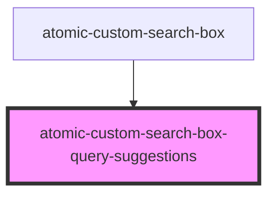

# atomic-custom-search-box-query-suggestions

<!-- Auto Generated Below -->

## Properties

| Property          | Attribute           | Description                                                                                                                                                                                                                                                                                 | Type     | Default     |
| ----------------- | ------------------- | ------------------------------------------------------------------------------------------------------------------------------------------------------------------------------------------------------------------------------------------------------------------------------------------- | -------- | ----------- |
| `icon`            | `icon`              | The SVG icon to display.  - Use a value that starts with `http://`, `https://`, `./`, or `../`, to fetch and display an icon from a given location. - Use a value that starts with `assets://`, to display an icon from the Atomic package. - Use a stringified SVG to display it directly. | `string` | `undefined` |
| `maxWithQuery`    | `max-with-query`    | The maximum number of suggestions that will be displayed if the user has typed something into the input field.                                                                                                                                                                              | `number` | `undefined` |
| `maxWithoutQuery` | `max-without-query` | The maximum number of suggestions that will be displayed initially when the input field is empty.                                                                                                                                                                                           | `number` | `undefined` |

## Shadow Parts

| Part                         | Description |
| ---------------------------- | ----------- |
| `"query-suggestion-content"` |             |
| `"query-suggestion-icon"`    |             |
| `"query-suggestion-text"`    |             |

## Dependencies

### Used by

 - [atomic-custom-search-box](../atomic-custom-search-box)

### Graph

----------------------------------------------

*Built with [StencilJS](https://stenciljs.com/)*
