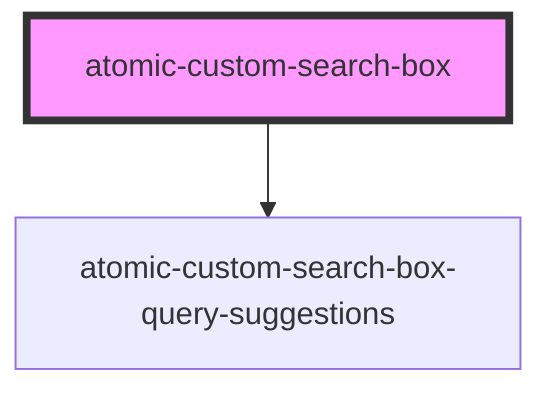

# atomic-custom-search-box


<!-- Auto Generated Below -->


## Overview

The `atomic-custom-search-box` component creates a search box with built-in support for suggestions.

## Properties

| Property             | Attribute              | Description                                                                                                                                                                                                                                                                                                                                                                                                                                                                                                                                      | Type      | Default     |
| -------------------- | ---------------------- | ------------------------------------------------------------------------------------------------------------------------------------------------------------------------------------------------------------------------------------------------------------------------------------------------------------------------------------------------------------------------------------------------------------------------------------------------------------------------------------------------------------------------------------------------ | --------- | ----------- |
| `clearFilters`       | `clear-filters`        | Whether to clear all active query filters when the end user submits a new query from the search box. Setting this option to "false" is not recommended & can lead to an increasing number of queries returning no results.                                                                                                                                                                                                                                                                                                                       | `boolean` | `true`      |
| `disableSearch`      | `disable-search`       | Whether to prevent the user from triggering searches and query suggestions from the component. Perfect for use cases where you need to disable the search conditionally.                                                                                                                                                                                                                                                                                                                                                                         | `boolean` | `false`     |
| `enableQuerySyntax`  | `enable-query-syntax`  | Whether to interpret advanced [Coveo Cloud query syntax](https://docs.coveo.com/en/1814/) in the query. You should only enable query syntax in the search box if you have good reasons to do so, as it requires end users to be familiar with Coveo Cloud query syntax, otherwise they will likely be surprised by the search box behaviour.  When the `redirection-url` property is set and redirects to a page with more `atomic-search-box` components, all `atomic-search-box` components need to have the same `enable-query-syntax` value. | `boolean` | `false`     |
| `minimumQueryLength` | `minimum-query-length` | The minimum query length required to enable search. For example, to disable the search for empty queries, set this to `1`.                                                                                                                                                                                                                                                                                                                                                                                                                       | `number`  | `0`         |
| `numberOfQueries`    | `number-of-queries`    | The amount of queries displayed when the user interacts with the search box. By default, a mix of query suggestions and recent queries will be shown. You can configure those settings using the following components as children:  - atomic-search-box-query-suggestions  - atomic-search-box-recent-queries                                                                                                                                                                                                                                    | `number`  | `8`         |
| `redirectionUrl`     | `redirection-url`      | Defining this option makes the search box standalone (see [Use a Standalone Search Box](https://docs.coveo.com/en/atomic/latest/usage/ssb/)).  This option defines the default URL the user should be redirected to, when a query is submitted. If a query pipeline redirect is triggered, it will redirect to that URL instead (see [query pipeline triggers](https://docs.coveo.com/en/1458)).                                                                                                                                                 | `string`  | `undefined` |
| `suggestionTimeout`  | `suggestion-timeout`   | The timeout for suggestion queries, in milliseconds. If a suggestion query times out, the suggestions from that particular query won't be shown.                                                                                                                                                                                                                                                                                                                                                                                                 | `number`  | `400`       |


## Events

| Event      | Description                                                                                                                                                                                                                                                                                                                                                                                                                                                                         | Type                              |
| ---------- | ----------------------------------------------------------------------------------------------------------------------------------------------------------------------------------------------------------------------------------------------------------------------------------------------------------------------------------------------------------------------------------------------------------------------------------------------------------------------------------- | --------------------------------- |
| `redirect` | Event that is emitted when a standalone search box redirection is triggered. By default, the search box will directly change the URL and redirect accordingly, so if you want to handle the redirection differently, use this event.  Example: ```html <script>   document.querySelector('atomic-search-box').addEventListener((e) => {     e.preventDefault();     // handle redirection   }); </script> ... <atomic-search-box redirection-url="/search"></atomic-search-box> ``` | `CustomEvent<RedirectionPayload>` |


## Dependencies

### Depends on

- [atomic-custom-search-box-query-suggestions](../atomic-custom-search-box-query-suggestions)

### Graph


----------------------------------------------

*Built with [StencilJS](https://stenciljs.com/)*
